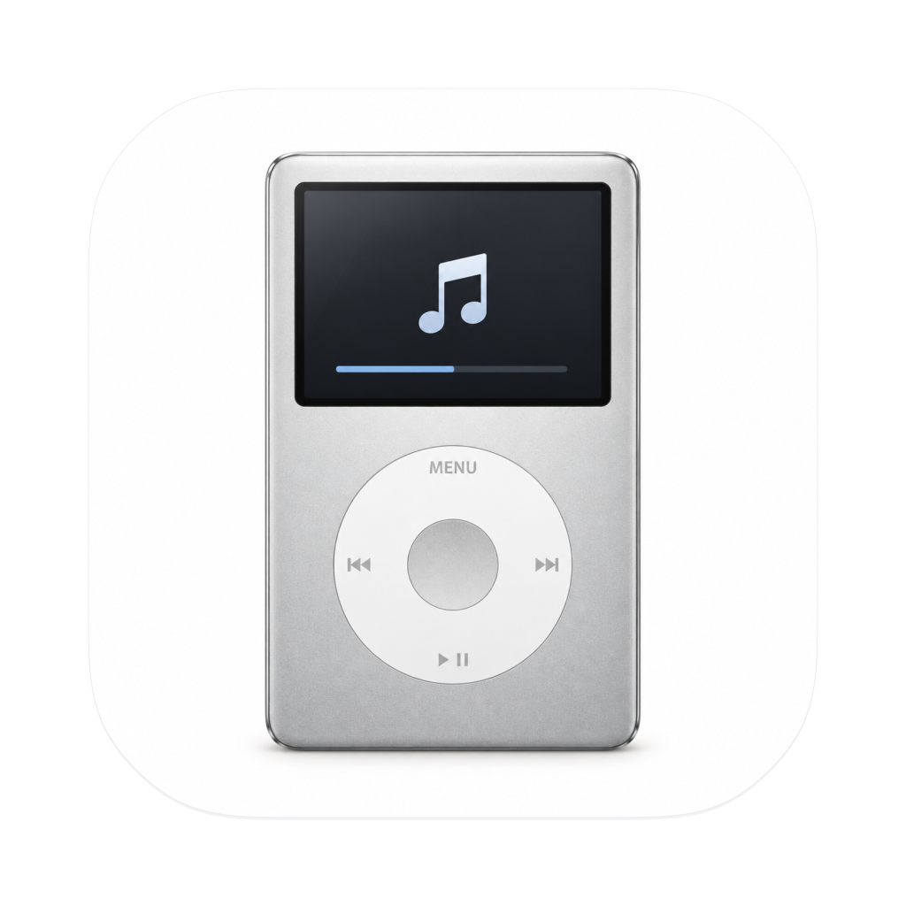

<p align="center">
  
</p>

# Music Bridge

给 iPod / Rockbox 爱好者的原生 macOS 音乐整理与导入工具。

粘贴歌单链接，连接你自己的本地下载工具，再手动把音乐导入 iPod。界面使用 AppKit、系统字体、原生控件与 SF Symbols；应用图标是一台银色 IPC3。

**当前为源码测试版。** 已在 Apple Silicon、macOS 27.2 上验证构建、启动、图标和未连接设备的界面。完整下载链路依赖外部服务和你自己的本地环境，尚未作为公开版本完成端到端验证；建议先用少量文件和已备份的设备试用。

## 可以做什么

- 识别网易云歌单或 Apple Music 公开歌单链接。
- 将网易云歌曲信息匹配到 Apple Music；无法确认的版本会跳过。
- 通过你独立安装的 `amdl` 与 wrapper-lite 发起下载，显示状态、进度和日志。
- 始终显示 iPod 连接状态；连接可写设备后才启用导入。
- 手动扫描下载目录、复制到设备的 `Music` 目录，并保留目录结构和旁置 `cover.jpg`。
- 借助 `ffprobe` 检查文件能否解析、编码、码率与内嵌封面。

下载完成和设备连接都不会自动触发导入，只有点击“开始导入”才会复制文件。

## 构建与启动

构建需要 macOS、Swift 6 或更新版本，以及包含 macOS 27 SDK 的开发工具。源码的最低运行版本为 macOS 14，较旧系统使用兼容界面；目前实际验证环境为 macOS 27.2。

安装 Apple 开发工具及 ImageMagick，然后在仓库根目录执行：

```bash
brew install imagemagick
swift build --package-path MacApp
bash script/build_and_run.sh --verify
```

脚本会生成并打开 `dist/MusicBridgeApp.app`，同时打包正式图标。也可以只编译 Swift 包，或用 `bash script/build_and_run.sh --logs` 查看系统日志。

本版未做 Developer ID 签名或公证，也未提供可直接安装的发行包。

## 配置本地下载工具

本仓库只包含 macOS 应用，不附带下载器或登录环境。请分别参照以下项目的说明配置：

- [amdl](https://github.com/zhaarey/apple-music-downloader)
- [wrapper-lite](https://github.com/WorldObservationLog/wrapper/tree/lite)

在 Music Bridge 菜单中选择“连接设置…”（`⌘,`），填写：

1. `amdl` 可执行文件的绝对路径。
2. 下载器工作目录，目录中应有你自己的 `config.yaml`。
3. wrapper-lite 服务地址，默认 `http://127.0.0.1:12340`。
4. 可选的 wrapper 启动脚本；服务已运行时可以不填。

路径保存在本机偏好设置中。账号登录和凭据配置由你在外部工具中完成；请不要把这些数据提交到仓库。

## iPod 导入

请先备份设备内容，再连接已挂载且可写的 Rockbox iPod。设备需要 `Music` 目录，并存在 `.rockbox`，或同时存在 `iPod_Control`。

导入会扫描配置中的音频目录和工作目录中名称以 `AM-DL` 开头的文件夹。点击“开始导入”前，请确认工作目录包含的都是你希望复制的内容。

**同路径且大小相同的文件会跳过；大小不同的同名目标文件会被替换。** 当前去重依据是路径和文件大小，不保证两个等大小文件的内容相同。导入尚不支持取消，也不会提供设备文件的回滚。

媒体检查需要 `ffprobe` 在应用的运行环境中可被找到。可通过 `brew install ffmpeg` 安装；如果从 Finder 启动时找不到它，请检查应用继承的 `PATH`。

旁置 `cover.jpg` 与音频中的内嵌封面是两项不同检查，报告中的内嵌封面结果不代表 Rockbox 封面浏览效果。

## 已知限制与隐私

- 网易云链接会发送给第三方 GoMusic 服务；Apple Music 匹配会访问 Apple 的网页与目录接口。依赖的服务发生变化时，相关功能可能失效。
- 当前匹配使用 Apple Music 中国区目录，不保证跨区或不同发行版本完全一致。
- wrapper-lite 必须在本机有效登录，并能返回正确的 `/status` 响应；应用不提供账号或订阅。
- 图标为静态 `.icns`，没有接入 Icon Composer 的系统动态折射。
- 仅限处理你有权访问的音乐；本仓库不包含音乐、下载器、登录数据或第三方服务的访问授权。

## 修改图标

`MusicBridgeArtwork.png` 是 IPC3 机身画稿，`MusicBridgeIcon.svg` 负责圆角、留白和布局，`MusicBridgeIcon.png` 是构建使用的正式导出图。

修改画稿或布局后，在安装了 Node.js 与 `sharp` 的环境中运行 `node script/render_icon.cjs`。常规构建直接使用已导出的 PNG，无需 Node.js。各尺寸 `.iconset` 只在临时目录中生成，打包后自动清理。

## 反馈与许可

欢迎提交 Issue 或 Pull Request。报告问题时请注明 macOS 版本、设备型号、触发步骤和经过脱敏的错误信息；不要附带账号凭据、完整配置、私人音乐或未经脱敏的日志。

本仓库采用 [MIT 许可证](LICENSE)。外部工具、服务、商标与素材来源见 [THIRD_PARTY_NOTICES.md](THIRD_PARTY_NOTICES.md)。
